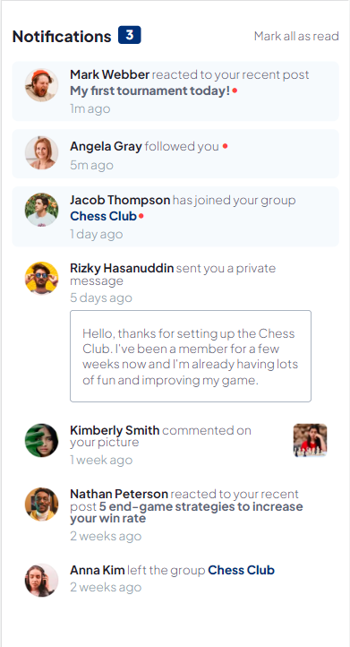

# Frontend Mentor - Notifications page solution

This is a solution to the [Notifications page challenge on Frontend Mentor](https://www.frontendmentor.io/challenges/notifications-page-DqK5QAmKbC). Frontend Mentor challenges help you improve your coding skills by building realistic projects. 

## Table of contents

- [Overview](#overview)
  - [The challenge](#the-challenge)
  - [Screenshot](#screenshot)
  - [Links](#links)
- [My process](#my-process)
  - [Built with](#built-with)
  - [Useful resources](#useful-resources)
- [Author](#author)

**Note: Delete this note and update the table of contents based on what sections you keep.**

## Overview

### The challenge

Users should be able to:

- Distinguish between "unread" and "read" notifications
- Select "Mark all as read" to toggle the visual state of the unread notifications and set the number of unread messages to zero
- View the optimal layout for the interface depending on their device's screen size
- See hover and focus states for all interactive elements on the page

### Screenshot

### Links

- Solution URL: [Add solution URL here](https://github.com/smash1t/fm-notifications)
- Live Site URL: [Add live site URL here](https://smash1t.github.io/fm-notifications)

## My process

### Built with

- Semantic HTML5 markup
- CSS
- Flexbox
- Mobile-first workflow
- JavaScript

### Useful resources

- [jQuery to Vanilla JavaScript Cheatsheet](https://tobiasahlin.com/blog/move-from-jquery-to-vanilla-javascript) - Useful reference when implementing 'Mark all as read' to toggle unread message styling & message count.

## Author

- Frontend Mentor - [@som2734](https://www.frontendmentor.io/profile/som2734)
- LinkedIn - 

